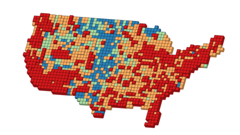

# American Geography



Updated for American Community Survey 1-Year Supplemental Estimates 2022 released Sep-Oct 2023. Release of ACS5YR 2022 data sceduled for Dec, 2023 - Jan, 2024 (see https://www.census.gov/programs-surveys/acs/news/data-releases/2022/release-schedule.html)

TODO: Accessing tables from https://api.census.gov/

1. [Importing](#1-importing)
2. [Processing](#2-processing)
2. [Exporting](#3-exporting)

## 1. Importing

Census geography files
```bash
#download national, substate files from https://www2.census.gov/geo/tiger/TGRGDB22/
#download puma, individual files from https://www2.census.gov/geo/tiger/TIGER2022/
#curl https://www2.census.gov/geo/tiger/TIGER2022/PUMA/ | grep 'tl_2022' | sed -e 's/^.*href="/https:\/\/www2\.census\.gov\/geo\/tiger\/TIGER2022\/PUMA\//g' -e 's/".*$//g' | while read file; do wget ${file}; sleep $[ ( $RANDOM % 10 )  + 1 ]s; done

# national level
ogr2ogr -overwrite -skipfailures --config PG_USE_COPY YES -f PGDump -t_srs "EPSG:3857" /vsistdout/ tlgdb_2022_a_us_nationgeo.gdb.zip | psql -d us -f -

# substate level
ogr2ogr -overwrite -skipfailures --config PG_USE_COPY YES -f PGDump -t_srs "EPSG:3857" /vsistdout/ tlgdb_2022_a_us_substategeo.gdb.zip | psql -d us -f -

# union census designated places and incorporated places
psql -d us -c "CREATE TABLE place AS (SELECT * FROM incorporated_place UNION ALL SELECT * FROM census_designated_place);"

# merge state puma files then import
ogrmerge.py -overwrite_ds -single -nln puma -o puma.gpkg $(ls *.zip | sed 's/^/\/vsizip\//g' | paste -sd' ')
ogr2ogr -overwrite -skipfailures -nlt promote_to_multi --config PG_USE_COPY YES -f PGDump -t_srs "EPSG:3857" /vsistdout/ puma.gpkg | psql -d us -f -
```

Census population tables
```bash
# download files from https://www2.census.gov/programs-surveys/popest/datasets/2020-2022/state/totals/NST-EST2022-ALLDATA.csv

iconv -f latin1 -t ascii//TRANSLIT NST-EST2022-ALLDATA.csv > NST-EST2022-alldata_iconv.csv
psql -d us -c "CREATE TABLE nst_est2022($(head -1 NST-EST2022-alldata_iconv.csv | sed -e 's/,/ VARCHAR,/g' -e 's/\r$/ VARCHAR/g'));"
psql -d us -c "\COPY nst_est2022 FROM 'NST-EST2022-alldata_iconv.csv' WITH CSV HEADER;"
```

Census data tables
```bash
#https://data.census.gov/table?d=ACS+1-Year+Estimates+Data+Profiles&y=2022&q=DP02,DP03,DP04,DP05&g=010XX00US
#https://data.census.gov/table?d=ACS+1-Year+Estimates+Data+Profiles&y=2022&q=DP02,DP03,DP04,DP05&g=010XX00US$0400000
#https://data.census.gov/table?d=ACS+1-Year+Estimates+Data+Profiles&y=2022&q=DP02,DP03,DP04,DP05&g=010XX00US$0500000
#https://data.census.gov/table?d=ACS+1-Year+Estimates+Data+Profiles&y=2022&q=DP02,DP03,DP04,DP05&g=010XX00US$1400000
#https://data.census.gov/table?d=ACS+1-Year+Estimates+Data+Profiles&y=2022&q=DP02,DP03,DP04,DP05&g=010XX00US$1600000
#https://data.census.gov/table?d=ACS+1-Year+Estimates+Data+Profiles&y=2022&q=DP02,DP03,DP04,DP05&g=010XX00US$7950000

geographies=('us' 'state' 'county' 'place' 'tract' 'puma')
files=('DP02' 'DP03' 'DP04' 'DP05')
for geography in ${geographies[*]}; do
  for file in ${files[*]}; do
    table=${file}_${geography}2022
    cat ${geography}/ACSDP1Y2022.${file}-Data.csv | awk 'NR!=2' | iconv -f latin1 -t ascii//TRANSLIT | sed -e 's/,$//g' > ${geography}/ACSDP1Y2022.${file}-Data_iconv.csv
    psql -d us -c "DROP TABLE IF EXISTS ${table}; CREATE TABLE ${table}($(head -1 ${geography}/ACSDP1Y2022.${file}-Data_iconv.csv | sed -e 's/"//g' -e 's/,/ VARCHAR,/g' -e 's/$/ VARCHAR/g'));"
    psql -d us -c "\COPY ${table} FROM ${geography}/ACSDP1Y2022.${file}-Data_iconv.csv WITH CSV HEADER;"
  done
done
```

NaturalEarth
```bash
ogr2ogr -overwrite -skipfailures --config PG_USE_COPY YES -f PGDump -t_srs "EPSG:3857" -nlt promote_to_multi /vsistdout/ natural_earth_vector_3857.gpkg ne_10m_admin_2_counties | psql -d us -f -
```

## 2. Processing

Select variables (mostly percentages) and create tables.
```bash
# us
psql -d us -c "DROP TABLE IF EXISTS us2022; CREATE TABLE us2022 AS SELECT a.*, DP05_0001E AS pop, DP05_0005PE AS age_5_under, DP05_0006PE AS age_5_9, DP05_0007PE AS age_10_14, DP05_0008PE AS age_15_19, DP05_0009PE AS age_20_24, DP05_0010PE AS age_25_34, DP05_0011PE AS age_35_44, DP05_0012PE AS age_45_54, DP05_0013PE AS age_55_59, DP05_0014PE AS age_60_64, DP05_0015PE AS age_65_74, DP05_0016PE AS age_75_84, DP05_0017PE AS age_85_over, DP05_0018E AS age_median, DP05_0019PE AS age_under18, DP05_0020PE AS age_16_over, DP05_0021PE AS age_18_over, DP05_0022PE AS age_21_over, DP05_0023PE AS age_62_over, DP05_0024PE AS age_65_over, DP05_0035PE AS race_mixed, DP05_0037PE AS race_white, DP05_0038PE AS race_black, DP05_0039PE AS race_native, DP05_0044PE AS race_asian, DP05_0052PE AS race_pacific, DP05_0071PE AS race_hispanic, DP05_0086E AS housing_total, DP03_0004PE AS employed, DP03_0005PE AS unemployed, DP03_0027PE AS job_bus_sci_art, DP03_0028PE AS job_service, DP03_0029PE AS job_sales, DP03_0030PE AS job_construction, DP03_0031PE AS job_prod_transpo, DP03_0033PE AS in_agri_mining, DP03_0034PE AS in_construction, DP03_0035PE AS in_manufacturing, DP03_0036PE AS in_wholesale, DP03_0037PE AS in_retail, DP03_0038PE AS in_transportation, DP03_0039PE AS in_information, DP03_0040PE AS in_finance, DP03_0041PE AS in_professional, DP03_0042PE AS in_education_health, DP03_0043PE AS in_arts_food, DP03_0044PE AS in_other, DP03_0045PE AS in_public_admin, DP03_0047PE AS class_private, DP03_0048PE AS class_govt, DP03_0049PE AS class_selfemployed, DP03_0050PE AS class_unpaid, DP03_0052PE AS income_10000_less, DP03_0053PE AS income_10000_14999, DP03_0054PE AS income_15000_24999, DP03_0055PE AS income_25000_34999, DP03_0056PE AS income_35000_49999, DP03_0057PE AS income_50000_74999, DP03_0058PE AS income_75000_99999, DP03_0059PE AS income_100000_149999, DP03_0060PE AS income_150000_199999, DP03_0061PE AS income_200000_more, DP03_0062E AS income_median, DP03_0063E AS income_mean, DP03_0088E AS income_percapita, DP03_0092E AS earnings_median, DP03_0093E AS earnings_male, DP03_0094E AS earnings_female, DP04_0001E AS housing_units, DP04_0002PE AS housing_occupied, DP04_0003PE AS housing_vacant, DP04_0004PE AS vacancy_homeowner, DP04_0005PE AS vacancy_rental, DP04_0007PE AS units_1_detached, DP04_0008PE AS units_1_attached, DP04_0009PE AS units_2, DP04_0010PE AS units_3_4, DP04_0011PE AS units_5_9, DP04_0012PE AS units_10_19, DP04_0013PE AS units_20_more, DP04_0014PE AS units_mobile, DP04_0015PE AS units_boat_rv_van, DP04_0017PE AS built_2014_later, DP04_0018PE AS built_2010_2013, DP04_0019PE AS built_2000_2009, DP04_0020PE AS built_1990_1999, DP04_0021PE AS built_1980_1989, DP04_0022PE AS built_1970_1979, DP04_0023PE AS built_1960_1969, DP04_0024PE AS built_1950_1959, DP04_0025PE AS built_1940_1949, DP04_0026PE AS built_1939_earlier, DP04_0028PE AS rooms_1, DP04_0029PE AS rooms_2, DP04_0030PE AS rooms_3, DP04_0031PE AS rooms_4, DP04_0032PE AS rooms_5, DP04_0033PE AS rooms_6, DP04_0034PE AS rooms_7, DP04_0035PE AS rooms_8, DP04_0036PE AS rooms_9, DP04_0037E AS rooms_median, DP04_0046PE AS occupied_owner, DP04_0047PE AS occupied_renter, DP04_0081PE AS value_50000_less, DP04_0082PE AS value_50000_99999, DP04_0083PE AS value_100000_149000, DP04_0084PE AS value_150000_199999, DP04_0085PE AS value_200000_299999, DP04_0086PE AS value_300000_499999, DP04_0087PE AS value_500000_999999, DP04_0088PE AS value_1000000_more, DP04_0089E AS value_median, DP04_0127PE AS rent_500_less, DP04_0128PE AS rent_500_999, DP04_0129PE AS rent_1000_1499, DP04_0130PE AS rent_1500_1999, DP04_0131PE AS rent_2000_2499, DP04_0132PE AS rent_2500_2999, DP04_0133PE AS rent_3000_more, DP04_0134E AS rent_median, DP04_0137PE AS grapi_15_less, DP04_0138PE AS grapi_15_19, DP04_0139PE AS grapi_20_24, DP04_0140PE AS grapi_25_29, DP04_0141PE AS grapi_30_34, DP04_0142PE AS grapi_35_more, DP02_0060PE AS edu_9_less, DP02_0061PE AS edu_9_12, DP02_0062PE AS edu_highschool, DP02_0063PE AS edu_college_nodegree, DP02_0064PE AS edu_associate_degree, DP02_0065PE AS edu_bachelor_degree, DP02_0066PE AS edu_grad_degree, DP02_0067PE AS edu_highschool_higher, DP02_0068PE AS edu_bachelor_higher, DP02_0125PE AS ancestry_american, DP02_0126PE AS ancestry_arab, DP02_0127PE AS ancestry_czech, DP02_0128PE AS ancestry_danish, DP02_0129PE AS ancestry_dutch, DP02_0130PE AS ancestry_english, DP02_0131PE AS ancestry_french, DP02_0132PE AS ancestry_frenchcanadian, DP02_0133PE AS ancestry_german, DP02_0134PE AS ancestry_greek, DP02_0135PE AS ancestry_hungarian, DP02_0136PE AS ancestry_irish, DP02_0137PE AS ancestry_italian, DP02_0138PE AS ancestry_lithuanian, DP02_0139PE AS ancestry_norwegian, DP02_0140PE AS ancestry_polish, DP02_0141PE AS ancestry_portuguese, DP02_0142PE AS ancestry_russian, DP02_0143PE AS ancestry_scottish_irish, DP02_0144PE AS ancestry_scottish, DP02_0145PE AS ancestry_slovak, DP02_0146PE AS ancestry_subsaharan_african, DP02_0147PE AS ancestry_swedish, DP02_0148PE AS ancestry_swiss, DP02_0149PE AS ancestry_ukranian, DP02_0150PE AS ancestry_welsh, DP02_0151PE AS ancestry_west_indian FROM nst_est2022 a, dp02_us2022 b, dp03_us2022 c, dp04_us2022 d, dp05_us2022 e WHERE a.name = 'United States';"

# states
psql -d us -c "DROP TABLE IF EXISTS state2022; CREATE TABLE state2022 AS SELECT a.shape, a.geoid, a.name, DP05_0001E AS pop, DP05_0005PE AS age_5_under, DP05_0006PE AS age_5_9, DP05_0007PE AS age_10_14, DP05_0008PE AS age_15_19, DP05_0009PE AS age_20_24, DP05_0010PE AS age_25_34, DP05_0011PE AS age_35_44, DP05_0012PE AS age_45_54, DP05_0013PE AS age_55_59, DP05_0014PE AS age_60_64, DP05_0015PE AS age_65_74, DP05_0016PE AS age_75_84, DP05_0017PE AS age_85_over, DP05_0018E AS age_median, DP05_0019PE AS age_under18, DP05_0020PE AS age_16_over, DP05_0021PE AS age_18_over, DP05_0022PE AS age_21_over, DP05_0023PE AS age_62_over, DP05_0024PE AS age_65_over, DP05_0035PE AS race_mixed, DP05_0037PE AS race_white, DP05_0038PE AS race_black, DP05_0039PE AS race_native, DP05_0044PE AS race_asian, DP05_0052PE AS race_pacific, DP05_0071PE AS race_hispanic, DP05_0086E AS housing_total, DP03_0004PE AS employed, DP03_0005PE AS unemployed, DP03_0027PE AS job_bus_sci_art, DP03_0028PE AS job_service, DP03_0029PE AS job_sales, DP03_0030PE AS job_construction, DP03_0031PE AS job_prod_transpo, DP03_0033PE AS in_agri_mining, DP03_0034PE AS in_construction, DP03_0035PE AS in_manufacturing, DP03_0036PE AS in_wholesale, DP03_0037PE AS in_retail, DP03_0038PE AS in_transportation, DP03_0039PE AS in_information, DP03_0040PE AS in_finance, DP03_0041PE AS in_professional, DP03_0042PE AS in_education_health, DP03_0043PE AS in_arts_food, DP03_0044PE AS in_other, DP03_0045PE AS in_public_admin, DP03_0047PE AS class_private, DP03_0048PE AS class_govt, DP03_0049PE AS class_selfemployed, DP03_0050PE AS class_unpaid, DP03_0052PE AS income_10000_less, DP03_0053PE AS income_10000_14999, DP03_0054PE AS income_15000_24999, DP03_0055PE AS income_25000_34999, DP03_0056PE AS income_35000_49999, DP03_0057PE AS income_50000_74999, DP03_0058PE AS income_75000_99999, DP03_0059PE AS income_100000_149999, DP03_0060PE AS income_150000_199999, DP03_0061PE AS income_200000_more, DP03_0062E AS income_median, DP03_0063E AS income_mean, DP03_0088E AS income_percapita, DP03_0092E AS earnings_median, DP03_0093E AS earnings_male, DP03_0094E AS earnings_female, DP04_0001E AS housing_units, DP04_0002PE AS housing_occupied, DP04_0003PE AS housing_vacant, DP04_0004PE AS vacancy_homeowner, DP04_0005PE AS vacancy_rental, DP04_0007PE AS units_1_detached, DP04_0008PE AS units_1_attached, DP04_0009PE AS units_2, DP04_0010PE AS units_3_4, DP04_0011PE AS units_5_9, DP04_0012PE AS units_10_19, DP04_0013PE AS units_20_more, DP04_0014PE AS units_mobile, DP04_0015PE AS units_boat_rv_van, DP04_0017PE AS built_2014_later, DP04_0018PE AS built_2010_2013, DP04_0019PE AS built_2000_2009, DP04_0020PE AS built_1990_1999, DP04_0021PE AS built_1980_1989, DP04_0022PE AS built_1970_1979, DP04_0023PE AS built_1960_1969, DP04_0024PE AS built_1950_1959, DP04_0025PE AS built_1940_1949, DP04_0026PE AS built_1939_earlier, DP04_0028PE AS rooms_1, DP04_0029PE AS rooms_2, DP04_0030PE AS rooms_3, DP04_0031PE AS rooms_4, DP04_0032PE AS rooms_5, DP04_0033PE AS rooms_6, DP04_0034PE AS rooms_7, DP04_0035PE AS rooms_8, DP04_0036PE AS rooms_9, DP04_0037E AS rooms_median, DP04_0046PE AS occupied_owner, DP04_0047PE AS occupied_renter, DP04_0081PE AS value_50000_less, DP04_0082PE AS value_50000_99999, DP04_0083PE AS value_100000_149000, DP04_0084PE AS value_150000_199999, DP04_0085PE AS value_200000_299999, DP04_0086PE AS value_300000_499999, DP04_0087PE AS value_500000_999999, DP04_0088PE AS value_1000000_more, DP04_0089E AS value_median, DP04_0127PE AS rent_500_less, DP04_0128PE AS rent_500_999, DP04_0129PE AS rent_1000_1499, DP04_0130PE AS rent_1500_1999, DP04_0131PE AS rent_2000_2499, DP04_0132PE AS rent_2500_2999, DP04_0133PE AS rent_3000_more, DP04_0134E AS rent_median, DP04_0137PE AS grapi_15_less, DP04_0138PE AS grapi_15_19, DP04_0139PE AS grapi_20_24, DP04_0140PE AS grapi_25_29, DP04_0141PE AS grapi_30_34, DP04_0142PE AS grapi_35_more, DP02_0060PE AS edu_9_less, DP02_0061PE AS edu_9_12, DP02_0062PE AS edu_highschool, DP02_0063PE AS edu_college_nodegree, DP02_0064PE AS edu_associate_degree, DP02_0065PE AS edu_bachelor_degree, DP02_0066PE AS edu_grad_degree, DP02_0067PE AS edu_highschool_higher, DP02_0068PE AS edu_bachelor_higher, DP02_0125PE AS ancestry_american, DP02_0126PE AS ancestry_arab, DP02_0127PE AS ancestry_czech, DP02_0128PE AS ancestry_danish, DP02_0129PE AS ancestry_dutch, DP02_0130PE AS ancestry_english, DP02_0131PE AS ancestry_french, DP02_0132PE AS ancestry_frenchcanadian, DP02_0133PE AS ancestry_german, DP02_0134PE AS ancestry_greek, DP02_0135PE AS ancestry_hungarian, DP02_0136PE AS ancestry_irish, DP02_0137PE AS ancestry_italian, DP02_0138PE AS ancestry_lithuanian, DP02_0139PE AS ancestry_norwegian, DP02_0140PE AS ancestry_polish, DP02_0141PE AS ancestry_portuguese, DP02_0142PE AS ancestry_russian, DP02_0143PE AS ancestry_scottish_irish, DP02_0144PE AS ancestry_scottish, DP02_0145PE AS ancestry_slovak, DP02_0146PE AS ancestry_subsaharan_african, DP02_0147PE AS ancestry_swedish, DP02_0148PE AS ancestry_swiss, DP02_0149PE AS ancestry_ukranian, DP02_0150PE AS ancestry_welsh, DP02_0151PE AS ancestry_west_indian FROM state a, dp02_state2022 b, dp03_state2022 c, dp04_state2022 d, dp05_state2022 e WHERE a.geoid = SUBSTRING(b.geo_id,10,2) AND a.geoid = SUBSTRING(c.geo_id,10,2) AND a.geoid = SUBSTRING(d.geo_id,10,2) AND a.geoid = SUBSTRING(e.geo_id,10,2);"

# counties
psql -d us -c "DROP TABLE IF EXISTS county2022; CREATE TABLE county2022 AS SELECT a.shape, a.geoid, a.namelsad AS name, DP05_0001E AS pop, DP05_0005PE AS age_5_under, DP05_0006PE AS age_5_9, DP05_0007PE AS age_10_14, DP05_0008PE AS age_15_19, DP05_0009PE AS age_20_24, DP05_0010PE AS age_25_34, DP05_0011PE AS age_35_44, DP05_0012PE AS age_45_54, DP05_0013PE AS age_55_59, DP05_0014PE AS age_60_64, DP05_0015PE AS age_65_74, DP05_0016PE AS age_75_84, DP05_0017PE AS age_85_over, DP05_0018E AS age_median, DP05_0019PE AS age_under18, DP05_0020PE AS age_16_over, DP05_0021PE AS age_18_over, DP05_0022PE AS age_21_over, DP05_0023PE AS age_62_over, DP05_0024PE AS age_65_over, DP05_0035PE AS race_mixed, DP05_0037PE AS race_white, DP05_0038PE AS race_black, DP05_0039PE AS race_native, DP05_0044PE AS race_asian, DP05_0052PE AS race_pacific, DP05_0071PE AS race_hispanic, DP05_0086E AS housing_total, DP03_0004PE AS employed, DP03_0005PE AS unemployed, DP03_0027PE AS job_bus_sci_art, DP03_0028PE AS job_service, DP03_0029PE AS job_sales, DP03_0030PE AS job_construction, DP03_0031PE AS job_prod_transpo, DP03_0033PE AS in_agri_mining, DP03_0034PE AS in_construction, DP03_0035PE AS in_manufacturing, DP03_0036PE AS in_wholesale, DP03_0037PE AS in_retail, DP03_0038PE AS in_transportation, DP03_0039PE AS in_information, DP03_0040PE AS in_finance, DP03_0041PE AS in_professional, DP03_0042PE AS in_education_health, DP03_0043PE AS in_arts_food, DP03_0044PE AS in_other, DP03_0045PE AS in_public_admin, DP03_0047PE AS class_private, DP03_0048PE AS class_govt, DP03_0049PE AS class_selfemployed, DP03_0050PE AS class_unpaid, DP03_0052PE AS income_10000_less, DP03_0053PE AS income_10000_14999, DP03_0054PE AS income_15000_24999, DP03_0055PE AS income_25000_34999, DP03_0056PE AS income_35000_49999, DP03_0057PE AS income_50000_74999, DP03_0058PE AS income_75000_99999, DP03_0059PE AS income_100000_149999, DP03_0060PE AS income_150000_199999, DP03_0061PE AS income_200000_more, DP03_0062E AS income_median, DP03_0063E AS income_mean, DP03_0088E AS income_percapita, DP03_0092E AS earnings_median, DP03_0093E AS earnings_male, DP03_0094E AS earnings_female, DP04_0001E AS housing_units, DP04_0002PE AS housing_occupied, DP04_0003PE AS housing_vacant, DP04_0004PE AS vacancy_homeowner, DP04_0005PE AS vacancy_rental, DP04_0007PE AS units_1_detached, DP04_0008PE AS units_1_attached, DP04_0009PE AS units_2, DP04_0010PE AS units_3_4, DP04_0011PE AS units_5_9, DP04_0012PE AS units_10_19, DP04_0013PE AS units_20_more, DP04_0014PE AS units_mobile, DP04_0015PE AS units_boat_rv_van, DP04_0017PE AS built_2014_later, DP04_0018PE AS built_2010_2013, DP04_0019PE AS built_2000_2009, DP04_0020PE AS built_1990_1999, DP04_0021PE AS built_1980_1989, DP04_0022PE AS built_1970_1979, DP04_0023PE AS built_1960_1969, DP04_0024PE AS built_1950_1959, DP04_0025PE AS built_1940_1949, DP04_0026PE AS built_1939_earlier, DP04_0028PE AS rooms_1, DP04_0029PE AS rooms_2, DP04_0030PE AS rooms_3, DP04_0031PE AS rooms_4, DP04_0032PE AS rooms_5, DP04_0033PE AS rooms_6, DP04_0034PE AS rooms_7, DP04_0035PE AS rooms_8, DP04_0036PE AS rooms_9, DP04_0037E AS rooms_median, DP04_0046PE AS occupied_owner, DP04_0047PE AS occupied_renter, DP04_0081PE AS value_50000_less, DP04_0082PE AS value_50000_99999, DP04_0083PE AS value_100000_149000, DP04_0084PE AS value_150000_199999, DP04_0085PE AS value_200000_299999, DP04_0086PE AS value_300000_499999, DP04_0087PE AS value_500000_999999, DP04_0088PE AS value_1000000_more, DP04_0089E AS value_median, DP04_0127PE AS rent_500_less, DP04_0128PE AS rent_500_999, DP04_0129PE AS rent_1000_1499, DP04_0130PE AS rent_1500_1999, DP04_0131PE AS rent_2000_2499, DP04_0132PE AS rent_2500_2999, DP04_0133PE AS rent_3000_more, DP04_0134E AS rent_median, DP04_0137PE AS grapi_15_less, DP04_0138PE AS grapi_15_19, DP04_0139PE AS grapi_20_24, DP04_0140PE AS grapi_25_29, DP04_0141PE AS grapi_30_34, DP04_0142PE AS grapi_35_more, DP02_0060PE AS edu_9_less, DP02_0061PE AS edu_9_12, DP02_0062PE AS edu_highschool, DP02_0063PE AS edu_college_nodegree, DP02_0064PE AS edu_associate_degree, DP02_0065PE AS edu_bachelor_degree, DP02_0066PE AS edu_grad_degree, DP02_0067PE AS edu_highschool_higher, DP02_0068PE AS edu_bachelor_higher, DP02_0125PE AS ancestry_american, DP02_0126PE AS ancestry_arab, DP02_0127PE AS ancestry_czech, DP02_0128PE AS ancestry_danish, DP02_0129PE AS ancestry_dutch, DP02_0130PE AS ancestry_english, DP02_0131PE AS ancestry_french, DP02_0132PE AS ancestry_frenchcanadian, DP02_0133PE AS ancestry_german, DP02_0134PE AS ancestry_greek, DP02_0135PE AS ancestry_hungarian, DP02_0136PE AS ancestry_irish, DP02_0137PE AS ancestry_italian, DP02_0138PE AS ancestry_lithuanian, DP02_0139PE AS ancestry_norwegian, DP02_0140PE AS ancestry_polish, DP02_0141PE AS ancestry_portuguese, DP02_0142PE AS ancestry_russian, DP02_0143PE AS ancestry_scottish_irish, DP02_0144PE AS ancestry_scottish, DP02_0145PE AS ancestry_slovak, DP02_0146PE AS ancestry_subsaharan_african, DP02_0147PE AS ancestry_swedish, DP02_0148PE AS ancestry_swiss, DP02_0149PE AS ancestry_ukranian, DP02_0150PE AS ancestry_welsh, DP02_0151PE AS ancestry_west_indian FROM county a, dp02_county2022 b, dp03_county2022 c, dp04_county2022 d, dp05_county2022 e WHERE a.geoid = SUBSTRING(b.geo_id,10,5) AND a.geoid = SUBSTRING(c.geo_id,10,5) AND a.geoid = SUBSTRING(d.geo_id,10,5) AND a.geoid = SUBSTRING(e.geo_id,10,5);"

# places
psql -d us -c "DROP TABLE IF EXISTS place2022; CREATE TABLE place2022 AS SELECT a.shape, a.geoid, a.namelsad as name, DP05_0001E AS pop, DP05_0005PE AS age_5_under, DP05_0006PE AS age_5_9, DP05_0007PE AS age_10_14, DP05_0008PE AS age_15_19, DP05_0009PE AS age_20_24, DP05_0010PE AS age_25_34, DP05_0011PE AS age_35_44, DP05_0012PE AS age_45_54, DP05_0013PE AS age_55_59, DP05_0014PE AS age_60_64, DP05_0015PE AS age_65_74, DP05_0016PE AS age_75_84, DP05_0017PE AS age_85_over, DP05_0018E AS age_median, DP05_0019PE AS age_under18, DP05_0020PE AS age_16_over, DP05_0021PE AS age_18_over, DP05_0022PE AS age_21_over, DP05_0023PE AS age_62_over, DP05_0024PE AS age_65_over, DP05_0035PE AS race_mixed, DP05_0037PE AS race_white, DP05_0038PE AS race_black, DP05_0039PE AS race_native, DP05_0044PE AS race_asian, DP05_0052PE AS race_pacific, DP05_0071PE AS race_hispanic, DP05_0086E AS housing_total, DP03_0004PE AS employed, DP03_0005PE AS unemployed, DP03_0027PE AS job_bus_sci_art, DP03_0028PE AS job_service, DP03_0029PE AS job_sales, DP03_0030PE AS job_construction, DP03_0031PE AS job_prod_transpo, DP03_0033PE AS in_agri_mining, DP03_0034PE AS in_construction, DP03_0035PE AS in_manufacturing, DP03_0036PE AS in_wholesale, DP03_0037PE AS in_retail, DP03_0038PE AS in_transportation, DP03_0039PE AS in_information, DP03_0040PE AS in_finance, DP03_0041PE AS in_professional, DP03_0042PE AS in_education_health, DP03_0043PE AS in_arts_food, DP03_0044PE AS in_other, DP03_0045PE AS in_public_admin, DP03_0047PE AS class_private, DP03_0048PE AS class_govt, DP03_0049PE AS class_selfemployed, DP03_0050PE AS class_unpaid, DP03_0052PE AS income_10000_less, DP03_0053PE AS income_10000_14999, DP03_0054PE AS income_15000_24999, DP03_0055PE AS income_25000_34999, DP03_0056PE AS income_35000_49999, DP03_0057PE AS income_50000_74999, DP03_0058PE AS income_75000_99999, DP03_0059PE AS income_100000_149999, DP03_0060PE AS income_150000_199999, DP03_0061PE AS income_200000_more, DP03_0062E AS income_median, DP03_0063E AS income_mean, DP03_0088E AS income_percapita, DP03_0092E AS earnings_median, DP03_0093E AS earnings_male, DP03_0094E AS earnings_female, DP04_0001E AS housing_units, DP04_0002PE AS housing_occupied, DP04_0003PE AS housing_vacant, DP04_0004PE AS vacancy_homeowner, DP04_0005PE AS vacancy_rental, DP04_0007PE AS units_1_detached, DP04_0008PE AS units_1_attached, DP04_0009PE AS units_2, DP04_0010PE AS units_3_4, DP04_0011PE AS units_5_9, DP04_0012PE AS units_10_19, DP04_0013PE AS units_20_more, DP04_0014PE AS units_mobile, DP04_0015PE AS units_boat_rv_van, DP04_0017PE AS built_2014_later, DP04_0018PE AS built_2010_2013, DP04_0019PE AS built_2000_2009, DP04_0020PE AS built_1990_1999, DP04_0021PE AS built_1980_1989, DP04_0022PE AS built_1970_1979, DP04_0023PE AS built_1960_1969, DP04_0024PE AS built_1950_1959, DP04_0025PE AS built_1940_1949, DP04_0026PE AS built_1939_earlier, DP04_0028PE AS rooms_1, DP04_0029PE AS rooms_2, DP04_0030PE AS rooms_3, DP04_0031PE AS rooms_4, DP04_0032PE AS rooms_5, DP04_0033PE AS rooms_6, DP04_0034PE AS rooms_7, DP04_0035PE AS rooms_8, DP04_0036PE AS rooms_9, DP04_0037E AS rooms_median, DP04_0046PE AS occupied_owner, DP04_0047PE AS occupied_renter, DP04_0081PE AS value_50000_less, DP04_0082PE AS value_50000_99999, DP04_0083PE AS value_100000_149000, DP04_0084PE AS value_150000_199999, DP04_0085PE AS value_200000_299999, DP04_0086PE AS value_300000_499999, DP04_0087PE AS value_500000_999999, DP04_0088PE AS value_1000000_more, DP04_0089E AS value_median, DP04_0127PE AS rent_500_less, DP04_0128PE AS rent_500_999, DP04_0129PE AS rent_1000_1499, DP04_0130PE AS rent_1500_1999, DP04_0131PE AS rent_2000_2499, DP04_0132PE AS rent_2500_2999, DP04_0133PE AS rent_3000_more, DP04_0134E AS rent_median, DP04_0137PE AS grapi_15_less, DP04_0138PE AS grapi_15_19, DP04_0139PE AS grapi_20_24, DP04_0140PE AS grapi_25_29, DP04_0141PE AS grapi_30_34, DP04_0142PE AS grapi_35_more, DP02_0060PE AS edu_9_less, DP02_0061PE AS edu_9_12, DP02_0062PE AS edu_highschool, DP02_0063PE AS edu_college_nodegree, DP02_0064PE AS edu_associate_degree, DP02_0065PE AS edu_bachelor_degree, DP02_0066PE AS edu_grad_degree, DP02_0067PE AS edu_highschool_higher, DP02_0068PE AS edu_bachelor_higher, DP02_0125PE AS ancestry_american, DP02_0126PE AS ancestry_arab, DP02_0127PE AS ancestry_czech, DP02_0128PE AS ancestry_danish, DP02_0129PE AS ancestry_dutch, DP02_0130PE AS ancestry_english, DP02_0131PE AS ancestry_french, DP02_0132PE AS ancestry_frenchcanadian, DP02_0133PE AS ancestry_german, DP02_0134PE AS ancestry_greek, DP02_0135PE AS ancestry_hungarian, DP02_0136PE AS ancestry_irish, DP02_0137PE AS ancestry_italian, DP02_0138PE AS ancestry_lithuanian, DP02_0139PE AS ancestry_norwegian, DP02_0140PE AS ancestry_polish, DP02_0141PE AS ancestry_portuguese, DP02_0142PE AS ancestry_russian, DP02_0143PE AS ancestry_scottish_irish, DP02_0144PE AS ancestry_scottish, DP02_0145PE AS ancestry_slovak, DP02_0146PE AS ancestry_subsaharan_african, DP02_0147PE AS ancestry_swedish, DP02_0148PE AS ancestry_swiss, DP02_0149PE AS ancestry_ukranian, DP02_0150PE AS ancestry_welsh, DP02_0151PE AS ancestry_west_indian FROM place a, dp02_place2022 b, dp03_place2022 c, dp04_place2022 d, dp05_place2022 e WHERE a.geoid = SUBSTRING(b.geo_id,10,7) AND a.geoid = SUBSTRING(c.geo_id,10,7) AND a.geoid = SUBSTRING(d.geo_id,10,7) AND a.geoid = SUBSTRING(e.geo_id,10,7);"

# census tracts
psql -d us -c "DROP TABLE IF EXISTS tract2023; CREATE TABLE tract2023 AS SELECT a.shape, a.geoid, a.namelsad AS name, DP05_0001E AS pop, DP05_0005PE AS age_5_under, DP05_0006PE AS age_5_9, DP05_0007PE AS age_10_14, DP05_0008PE AS age_15_19, DP05_0009PE AS age_20_24, DP05_0010PE AS age_25_34, DP05_0011PE AS age_35_44, DP05_0012PE AS age_45_54, DP05_0013PE AS age_55_59, DP05_0014PE AS age_60_64, DP05_0015PE AS age_65_74, DP05_0016PE AS age_75_84, DP05_0017PE AS age_85_over, DP05_0018E AS age_median, DP05_0019PE AS age_under18, DP05_0020PE AS age_16_over, DP05_0021PE AS age_18_over, DP05_0022PE AS age_21_over, DP05_0023PE AS age_62_over, DP05_0024PE AS age_65_over, DP05_0035PE AS race_mixed, DP05_0037PE AS race_white, DP05_0038PE AS race_black, DP05_0039PE AS race_native, DP05_0044PE AS race_asian, DP05_0052PE AS race_pacific, DP05_0071PE AS race_hispanic, DP05_0086E AS housing_total, DP03_0004PE AS employed, DP03_0005PE AS unemployed, DP03_0027PE AS job_bus_sci_art, DP03_0028PE AS job_service, DP03_0029PE AS job_sales, DP03_0030PE AS job_construction, DP03_0031PE AS job_prod_transpo, DP03_0033PE AS in_agri_mining, DP03_0034PE AS in_construction, DP03_0035PE AS in_manufacturing, DP03_0036PE AS in_wholesale, DP03_0037PE AS in_retail, DP03_0038PE AS in_transportation, DP03_0039PE AS in_information, DP03_0040PE AS in_finance, DP03_0041PE AS in_professional, DP03_0042PE AS in_education_health, DP03_0043PE AS in_arts_food, DP03_0044PE AS in_other, DP03_0045PE AS in_public_admin, DP03_0047PE AS class_private, DP03_0048PE AS class_govt, DP03_0049PE AS class_selfemployed, DP03_0050PE AS class_unpaid, DP03_0052PE AS income_10000_less, DP03_0053PE AS income_10000_14999, DP03_0054PE AS income_15000_24999, DP03_0055PE AS income_25000_34999, DP03_0056PE AS income_35000_49999, DP03_0057PE AS income_50000_74999, DP03_0058PE AS income_75000_99999, DP03_0059PE AS income_100000_149999, DP03_0060PE AS income_150000_199999, DP03_0061PE AS income_200000_more, DP03_0062E AS income_median, DP03_0063E AS income_mean, DP03_0088E AS income_percapita, DP03_0092E AS earnings_median, DP03_0093E AS earnings_male, DP03_0094E AS earnings_female, DP04_0001E AS housing_units, DP04_0002PE AS housing_occupied, DP04_0003PE AS housing_vacant, DP04_0004PE AS vacancy_homeowner, DP04_0005PE AS vacancy_rental, DP04_0007PE AS units_1_detached, DP04_0008PE AS units_1_attached, DP04_0009PE AS units_2, DP04_0010PE AS units_3_4, DP04_0011PE AS units_5_9, DP04_0012PE AS units_10_19, DP04_0013PE AS units_20_more, DP04_0014PE AS units_mobile, DP04_0015PE AS units_boat_rv_van, DP04_0017PE AS built_2014_later, DP04_0018PE AS built_2010_2013, DP04_0019PE AS built_2000_2009, DP04_0020PE AS built_1990_1999, DP04_0021PE AS built_1980_1989, DP04_0022PE AS built_1970_1979, DP04_0023PE AS built_1960_1969, DP04_0024PE AS built_1950_1959, DP04_0025PE AS built_1940_1949, DP04_0026PE AS built_1939_earlier, DP04_0028PE AS rooms_1, DP04_0029PE AS rooms_2, DP04_0030PE AS rooms_3, DP04_0031PE AS rooms_4, DP04_0032PE AS rooms_5, DP04_0033PE AS rooms_6, DP04_0034PE AS rooms_7, DP04_0035PE AS rooms_8, DP04_0036PE AS rooms_9, DP04_0037E AS rooms_median, DP04_0046PE AS occupied_owner, DP04_0047PE AS occupied_renter, DP04_0081PE AS value_50000_less, DP04_0082PE AS value_50000_99999, DP04_0083PE AS value_100000_149000, DP04_0084PE AS value_150000_199999, DP04_0085PE AS value_200000_299999, DP04_0086PE AS value_300000_499999, DP04_0087PE AS value_500000_999999, DP04_0088PE AS value_1000000_more, DP04_0089E AS value_median, DP04_0127PE AS rent_500_less, DP04_0128PE AS rent_500_999, DP04_0129PE AS rent_1000_1499, DP04_0130PE AS rent_1500_1999, DP04_0131PE AS rent_2000_2499, DP04_0132PE AS rent_2500_2999, DP04_0133PE AS rent_3000_more, DP04_0134E AS rent_median, DP04_0137PE AS grapi_15_less, DP04_0138PE AS grapi_15_19, DP04_0139PE AS grapi_20_24, DP04_0140PE AS grapi_25_29, DP04_0141PE AS grapi_30_34, DP04_0142PE AS grapi_35_more, DP02_0060PE AS edu_9_less, DP02_0061PE AS edu_9_12, DP02_0062PE AS edu_highschool, DP02_0063PE AS edu_college_nodegree, DP02_0064PE AS edu_associate_degree, DP02_0065PE AS edu_bachelor_degree, DP02_0066PE AS edu_grad_degree, DP02_0067PE AS edu_highschool_higher, DP02_0068PE AS edu_bachelor_higher, DP02_0125PE AS ancestry_american, DP02_0126PE AS ancestry_arab, DP02_0127PE AS ancestry_czech, DP02_0128PE AS ancestry_danish, DP02_0129PE AS ancestry_dutch, DP02_0130PE AS ancestry_english, DP02_0131PE AS ancestry_french, DP02_0132PE AS ancestry_frenchcanadian, DP02_0133PE AS ancestry_german, DP02_0134PE AS ancestry_greek, DP02_0135PE AS ancestry_hungarian, DP02_0136PE AS ancestry_irish, DP02_0137PE AS ancestry_italian, DP02_0138PE AS ancestry_lithuanian, DP02_0139PE AS ancestry_norwegian, DP02_0140PE AS ancestry_polish, DP02_0141PE AS ancestry_portuguese, DP02_0142PE AS ancestry_russian, DP02_0143PE AS ancestry_scottish_irish, DP02_0144PE AS ancestry_scottish, DP02_0145PE AS ancestry_slovak, DP02_0146PE AS ancestry_subsaharan_african, DP02_0147PE AS ancestry_swedish, DP02_0148PE AS ancestry_swiss, DP02_0149PE AS ancestry_ukranian, DP02_0150PE AS ancestry_welsh, DP02_0151PE AS ancestry_west_indian FROM census_tract a, dp02_tract_2023 b, dp03_tract_2023 c, dp04_tract_2023 d, dp05_tract_2023 e WHERE a.geoid = SUBSTRING(b.geo_id,10,11) AND a.geoid = SUBSTRING(c.geo_id,10,11) AND a.geoid = SUBSTRING(d.geo_id,10,11) AND a.geoid = SUBSTRING(e.geo_id,10,11);"

# pumas
psql -d us -c "DROP TABLE IF EXISTS puma2022; CREATE TABLE puma2022 AS SELECT DISTINCT ON (b.name) a.geom AS shape, a.geoid20 AS geoid, a.namelsad20 AS name, DP05_0001E AS pop, DP05_0005PE AS age_5_under, DP05_0006PE AS age_5_9, DP05_0007PE AS age_10_14, DP05_0008PE AS age_15_19, DP05_0009PE AS age_20_24, DP05_0010PE AS age_25_34, DP05_0011PE AS age_35_44, DP05_0012PE AS age_45_54, DP05_0013PE AS age_55_59, DP05_0014PE AS age_60_64, DP05_0015PE AS age_65_74, DP05_0016PE AS age_75_84, DP05_0017PE AS age_85_over, DP05_0018E AS age_median, DP05_0019PE AS age_under18, DP05_0020PE AS age_16_over, DP05_0021PE AS age_18_over, DP05_0022PE AS age_21_over, DP05_0023PE AS age_62_over, DP05_0024PE AS age_65_over, DP05_0035PE AS race_mixed, DP05_0037PE AS race_white, DP05_0038PE AS race_black, DP05_0039PE AS race_native, DP05_0044PE AS race_asian, DP05_0052PE AS race_pacific, DP05_0071PE AS race_hispanic, DP05_0086E AS housing_total, DP03_0004PE AS employed, DP03_0005PE AS unemployed, DP03_0027PE AS job_bus_sci_art, DP03_0028PE AS job_service, DP03_0029PE AS job_sales, DP03_0030PE AS job_construction, DP03_0031PE AS job_prod_transpo, DP03_0033PE AS in_agri_mining, DP03_0034PE AS in_construction, DP03_0035PE AS in_manufacturing, DP03_0036PE AS in_wholesale, DP03_0037PE AS in_retail, DP03_0038PE AS in_transportation, DP03_0039PE AS in_information, DP03_0040PE AS in_finance, DP03_0041PE AS in_professional, DP03_0042PE AS in_education_health, DP03_0043PE AS in_arts_food, DP03_0044PE AS in_other, DP03_0045PE AS in_public_admin, DP03_0047PE AS class_private, DP03_0048PE AS class_govt, DP03_0049PE AS class_selfemployed, DP03_0050PE AS class_unpaid, DP03_0052PE AS income_10000_less, DP03_0053PE AS income_10000_14999, DP03_0054PE AS income_15000_24999, DP03_0055PE AS income_25000_34999, DP03_0056PE AS income_35000_49999, DP03_0057PE AS income_50000_74999, DP03_0058PE AS income_75000_99999, DP03_0059PE AS income_100000_149999, DP03_0060PE AS income_150000_199999, DP03_0061PE AS income_200000_more, DP03_0062E AS income_median, DP03_0063E AS income_mean, DP03_0088E AS income_percapita, DP03_0092E AS earnings_median, DP03_0093E AS earnings_male, DP03_0094E AS earnings_female, DP04_0001E AS housing_units, DP04_0002PE AS housing_occupied, DP04_0003PE AS housing_vacant, DP04_0004PE AS vacancy_homeowner, DP04_0005PE AS vacancy_rental, DP04_0007PE AS units_1_detached, DP04_0008PE AS units_1_attached, DP04_0009PE AS units_2, DP04_0010PE AS units_3_4, DP04_0011PE AS units_5_9, DP04_0012PE AS units_10_19, DP04_0013PE AS units_20_more, DP04_0014PE AS units_mobile, DP04_0015PE AS units_boat_rv_van, DP04_0017PE AS built_2014_later, DP04_0018PE AS built_2010_2013, DP04_0019PE AS built_2000_2009, DP04_0020PE AS built_1990_1999, DP04_0021PE AS built_1980_1989, DP04_0022PE AS built_1970_1979, DP04_0023PE AS built_1960_1969, DP04_0024PE AS built_1950_1959, DP04_0025PE AS built_1940_1949, DP04_0026PE AS built_1939_earlier, DP04_0028PE AS rooms_1, DP04_0029PE AS rooms_2, DP04_0030PE AS rooms_3, DP04_0031PE AS rooms_4, DP04_0032PE AS rooms_5, DP04_0033PE AS rooms_6, DP04_0034PE AS rooms_7, DP04_0035PE AS rooms_8, DP04_0036PE AS rooms_9, DP04_0037E AS rooms_median, DP04_0046PE AS occupied_owner, DP04_0047PE AS occupied_renter, DP04_0081PE AS value_50000_less, DP04_0082PE AS value_50000_99999, DP04_0083PE AS value_100000_149000, DP04_0084PE AS value_150000_199999, DP04_0085PE AS value_200000_299999, DP04_0086PE AS value_300000_499999, DP04_0087PE AS value_500000_999999, DP04_0088PE AS value_1000000_more, DP04_0089E AS value_median, DP04_0127PE AS rent_500_less, DP04_0128PE AS rent_500_999, DP04_0129PE AS rent_1000_1499, DP04_0130PE AS rent_1500_1999, DP04_0131PE AS rent_2000_2499, DP04_0132PE AS rent_2500_2999, DP04_0133PE AS rent_3000_more, DP04_0134E AS rent_median, DP04_0137PE AS grapi_15_less, DP04_0138PE AS grapi_15_19, DP04_0139PE AS grapi_20_24, DP04_0140PE AS grapi_25_29, DP04_0141PE AS grapi_30_34, DP04_0142PE AS grapi_35_more, DP02_0060PE AS edu_9_less, DP02_0061PE AS edu_9_12, DP02_0062PE AS edu_highschool, DP02_0063PE AS edu_college_nodegree, DP02_0064PE AS edu_associate_degree, DP02_0065PE AS edu_bachelor_degree, DP02_0066PE AS edu_grad_degree, DP02_0067PE AS edu_highschool_higher, DP02_0068PE AS edu_bachelor_higher, DP02_0125PE AS ancestry_american, DP02_0126PE AS ancestry_arab, DP02_0127PE AS ancestry_czech, DP02_0128PE AS ancestry_danish, DP02_0129PE AS ancestry_dutch, DP02_0130PE AS ancestry_english, DP02_0131PE AS ancestry_french, DP02_0132PE AS ancestry_frenchcanadian, DP02_0133PE AS ancestry_german, DP02_0134PE AS ancestry_greek, DP02_0135PE AS ancestry_hungarian, DP02_0136PE AS ancestry_irish, DP02_0137PE AS ancestry_italian, DP02_0138PE AS ancestry_lithuanian, DP02_0139PE AS ancestry_norwegian, DP02_0140PE AS ancestry_polish, DP02_0141PE AS ancestry_portuguese, DP02_0142PE AS ancestry_russian, DP02_0143PE AS ancestry_scottish_irish, DP02_0144PE AS ancestry_scottish, DP02_0145PE AS ancestry_slovak, DP02_0146PE AS ancestry_subsaharan_african, DP02_0147PE AS ancestry_swedish, DP02_0148PE AS ancestry_swiss, DP02_0149PE AS ancestry_ukranian, DP02_0150PE AS ancestry_welsh, DP02_0151PE AS ancestry_west_indian FROM puma a, dp02_puma2022 b, dp03_puma2022 c, dp04_puma2022 d, dp05_puma2022 e WHERE a.geoid20 = SUBSTRING(b.geo_id,10,7) AND a.geoid20 = SUBSTRING(c.geo_id,10,7) AND a.geoid20 = SUBSTRING(d.geo_id,10,7) AND a.geoid20 = SUBSTRING(e.geo_id,10,7);"
```

Index for faster processing.
```bash
geographies=('state' 'county' 'place' 'puma')
for geography in ${geographies[*]}; do
  psql -d us -c "ALTER TABLE ${geography}2022 ADD PRIMARY KEY (geoid); CREATE INDEX ${geography}2022_gid ON ${geography}2022 USING GIST (shape);"
done
```

Add zscores.
```bash
# states
psql -qAtX -d us -c '\d state2022;' | grep -v "shape" | grep -v "geoid" | grep -v "name" | sed -e 's/|.*//g' | while read column; do
  psql -d us -c "ALTER TABLE state2022 ADD COLUMN zscore_${column} REAL; WITH b AS (SELECT geoid, (${column}::real - AVG(${column}::real) OVER()) / STDDEV(${column}::real) OVER() AS zscore FROM state2022 WHERE CAST(${column} AS TEXT) ~ '^[0-9\\\.]+$') UPDATE state2022 a SET zscore_${column} = b.zscore FROM b WHERE a.geoid = b.geoid;"
done

# counties
psql -qAtX -d us -c '\d county2022;' | grep -v "shape" | grep -v "geoid" | grep -v "name" | sed -e 's/|.*//g' | while read column; do
  psql -d us -c "ALTER TABLE county2022 ADD COLUMN zscore_${column} REAL; WITH b AS (SELECT geoid, (${column}::real - AVG(${column}::real) OVER()) / STDDEV(${column}::real) OVER() AS zscore FROM county2022 WHERE CAST(${column} AS TEXT) ~ '^[0-9\\\.]+$') UPDATE county2022 a SET zscore_${column} = b.zscore FROM b WHERE a.geoid = b.geoid;"
done

# places
psql -qAtX -d us -c '\d place2022;' |  grep -v "shape" | grep -v "geoid" | grep -v "name" | sed -e 's/|.*//g' | while read column; do
  psql -d us -c "ALTER TABLE place2022 ADD COLUMN zscore_${column} REAL; WITH b AS (SELECT geoid, (${column}::real - AVG(${column}::real) OVER()) / STDDEV(${column}::real) OVER() AS zscore FROM place2022 WHERE ${column}::text ~ '^[0-9\\\.]+$') UPDATE place2022 a SET zscore_${column} = b.zscore FROM b WHERE a.geoid = b.geoid;"
done

# pumas
psql -qAtX -d us -c '\d puma2022' | grep -v "shape" | grep -v "geoid" | grep -v "name" | sed -e 's/|.*//g' | while read column; do
  psql -d us -c "ALTER TABLE puma2022 ADD COLUMN zscore_${column} REAL; WITH b AS (SELECT geoid, (${column}::real - AVG(${column}::real) OVER()) / STDDEV(${column}::real) OVER() AS zscore FROM puma2022 WHERE CAST(${column} AS TEXT) ~ '^[0-9\\\.]+$') UPDATE puma2022 a SET zscore_${column} = b.zscore FROM b WHERE a.geoid = b.geoid;"
done
```

Find zscores over 1.65 and summarize at different geographies.
```bash
# states
psql -d us -c "ALTER TABLE state2022 ADD COLUMN zscore_1_65 jsonb;"
psql -Aqt -d us -c "COPY (SELECT geoid, name from state2022) TO STDOUT DELIMITER E'\t';" | while IFS=$'\t' read -a array; do
  columns=$(psql -Aqt -d us -c "WITH b AS (SELECT $(psql -Aqt -d us -c '\d state2022' | grep "zscore_" | sed -e 's/|.*//g' | paste -sd,) FROM state2022 WHERE geoid = '${array[0]}') SELECT (x).key FROM (SELECT EACH(hstore(b)) x FROM b) q WHERE CAST((x).value AS VARCHAR) ~ '^[0-9\\\.]+$' AND ABS(CAST((x).value AS REAL)) >= 1.65;" | paste -sd,)
  psql -d us -c "UPDATE state2022 a SET zscore_1_65 = (SELECT to_jsonb(inputs) FROM (SELECT $(echo ${columns} | tr ',' '\n' | sed -e 's/zscore_//g' -e "s/.*/CONCAT\('{state:', a\.\0, '|us:', b\.\0\, '}') AS \0/g" | paste -sd,) FROM state2022 a, us2022 b WHERE a.geoid = '${array[0]}') inputs) WHERE a.geoid = '${array[0]}';"
done

# counties
psql -d us -c "ALTER TABLE county2022 ADD COLUMN zscore_1_65 jsonb;"
psql -Aqt -d us -c "COPY (SELECT geoid, name from county2022) TO STDOUT DELIMITER E'\t';" | while IFS=$'\t' read -a array; do
  columns=$(psql -Aqt -d us -c "WITH b AS (SELECT $(psql -Aqt -d us -c '\d county2022' | grep "zscore_" | sed -e 's/|.*//g' | paste -sd,) FROM county2022 WHERE geoid = '${array[0]}') SELECT (x).key FROM (SELECT EACH(hstore(b)) x FROM b) q WHERE CAST((x).value AS VARCHAR) ~ '^[0-9\\\.]+$' AND ABS(CAST((x).value AS REAL)) >= 1.65;" | paste -sd,)
  psql -d us -c "UPDATE county2022 a SET zscore_1_65 = (SELECT to_jsonb(inputs) FROM (SELECT $(echo ${columns} | tr ',' '\n' | sed -e 's/zscore_//g' -e "s/.*/CONCAT\('{county:', a\.\0, '|state:', b\.\0\, '|us:', c\.\0\, '}') AS \0/g" | paste -sd,) FROM county2022 a, state2022 b, us2022 c WHERE a.geoid = '${array[0]}' AND SUBSTRING(a.geoid,1,2) = b.geoid) inputs) WHERE a.geoid = '${array[0]}';"
done

# places
psql -d us -c "ALTER TABLE place2022 ADD COLUMN zscore_1_65 jsonb;"
psql -Aqt -d us -c "COPY (SELECT geoid, name from place2022) TO STDOUT DELIMITER E'\t';" | while IFS=$'\t' read -a array; do
  columns=$(psql -Aqt -d us -c "WITH b AS (SELECT $(psql -Aqt -d us -c '\d place2022' | grep "zscore_" | sed -e 's/|.*//g' | paste -sd,) FROM place2022 WHERE geoid = '${array[0]}') SELECT (x).key FROM (SELECT EACH(hstore(b)) x FROM b) q WHERE CAST((x).value AS VARCHAR) ~ '^[0-9\\\.]+$' AND ABS(CAST((x).value AS REAL)) >= 1.65;" | paste -sd,)
  psql -d us -c "UPDATE place2022 a SET zscore_1_65 = (SELECT to_jsonb(inputs) FROM (SELECT $(echo ${columns} | tr ',' '\n' | sed -e 's/zscore_//g' -e "s/.*/CONCAT\('{place:', a\.\0, '|state:', b\.\0\, '|us:', c\.\0\, '}') AS \0/g" | paste -sd,) FROM place2022 a, state2022 b, us2022 c WHERE a.geoid = '${array[0]}' AND SUBSTRING(a.geoid,1,2) = b.geoid) inputs) WHERE a.geoid = '${array[0]}';"
done

# pumas
psql -d us -c "ALTER TABLE puma2022 ADD COLUMN zscore_1_65 jsonb;"
psql -Aqt -d us -c "COPY (SELECT geoid, name from puma2022) TO STDOUT DELIMITER E'\t';" | while IFS=$'\t' read -a array; do
  columns=$(psql -Aqt -d us -c "WITH b AS (SELECT $(psql -Aqt -d us -c '\d puma2022' | grep "zscore_" | sed -e 's/|.*//g' | paste -sd,) FROM puma2022 WHERE geoid = '${array[0]}') SELECT (x).key FROM (SELECT EACH(hstore(b)) x FROM b) q WHERE CAST((x).value AS VARCHAR) ~ '^[0-9\\\.]+$' AND ABS(CAST((x).value AS REAL)) >= 1.65;" | paste -sd,)
  psql -d us -c "UPDATE puma2022 a SET zscore_1_65 = (SELECT to_jsonb(inputs) FROM (SELECT $(echo ${columns} | tr ',' '\n' | sed -e 's/zscore_//g' -e "s/.*/CONCAT\('{puma:', a\.\0, '|county:', b\.\0\, '|state:', c\.\0\, '|us:', d\.\0\, '}') AS \0/g" | paste -sd,) FROM puma2022 a, county2022 b, state2022 c, us2022 d WHERE a.geoid = '${array[0]}' AND SUBSTRING(a.geoid,1,5) = b.geoid AND SUBSTRING(a.geoid,1,2) = c.geoid) inputs) WHERE a.geoid = '${array[0]}';"
done
```

## 3. Exporting

Export geojson files for qgis.
```bash
# states
psql -qAtX -d us -c '\d state2022;' | grep -v "shape" | grep -v "geoid" | grep -v "name" | grep -v "zscore_" | sed -e 's/|.*//g' | while read column; do
  psql -d us -c "COPY (SELECT jsonb_build_object('type', 'FeatureCollection', 'features', jsonb_agg(feature)) FROM (SELECT jsonb_build_object('type', 'Feature', 'id', geoid, 'geometry', ST_AsGeoJSON(shape)::jsonb, 'properties', to_jsonb(inputs) - 'shape' - 'geoid') AS feature FROM (SELECT shape, geoid, name, RANK() OVER (ORDER BY ${column}::real DESC) rank, ${column}::real FROM state2022 WHERE ${column}::text ~ '^[0-9\\\.]+$') inputs) features) TO STDOUT;" > geojson/state/state2022_${column}.geojson
done
```

Export geojson files for leaflet.
```bash
# county2022 quartiles (with simplified geometry from naturalearth)
psql -qAtX -d us -c '\d county2022;' | grep -v "shape" | grep -v "geoid" | grep -v "name" | grep -v "zscore_" | sed -e 's/|.*//g' | while read column; do
  psql -d us -c "COPY (SELECT jsonb_build_object('type', 'FeatureCollection', 'features', jsonb_agg(feature)) FROM (SELECT jsonb_build_object('type', 'Feature', 'id', quartile, 'geometry', ST_AsGeoJSON(ST_Transform(geom,4326))::jsonb, 'properties', to_jsonb(inputs) - 'geom') AS feature FROM (WITH stats AS (SELECT DISTINCT PERCENTILE_CONT(0.25) WITHIN GROUP (ORDER BY ${column}::real) q1, PERCENTILE_CONT(0.5) WITHIN GROUP (ORDER BY ${column}::real) q2, PERCENTILE_CONT(0.75) WITHIN GROUP (ORDER BY ${column}::real) q3 FROM county2022 WHERE ${column}::text ~ '^[0-9\\\.]+$') SELECT 'q1' AS quartile, MIN(${column}::real) AS min, MAX(${column}::real) AS max, ST_Union(ST_Buffer(b.geom,0)) AS geom FROM county2022 a, ne_10m_admin_2_counties_lakes b, stats WHERE a.${column}::text ~ '^[0-9\\\.]+$' AND a.${column}::real < stats.q1 AND a.geoid = b.code_local UNION ALL SELECT 'q2' AS quartile, MIN(${column}::real) AS min, MAX(${column}::real) AS max, ST_Union(ST_Buffer(b.geom,0)) AS geom FROM county2022 a, ne_10m_admin_2_counties_lakes b, stats WHERE a.${column}::text ~ '^[0-9\\\.]+$' AND a.${column}::real >= stats.q1 AND a.${column}::real < stats.q2 AND a.geoid = b.code_local UNION ALL SELECT 'q3' AS quartile, MIN(${column}::real) AS min, MAX(${column}::real) AS max, ST_Union(ST_Buffer(b.geom,0)) AS geom FROM county2022 a, ne_10m_admin_2_counties_lakes b, stats WHERE a.${column}::text ~ '^[0-9\\\.]+$' AND a.${column}::real >= stats.q2 AND a.${column}::real < stats.q3 AND a.geoid = b.code_local UNION ALL SELECT 'q4' AS quartile, MIN(${column}::real) AS min, MAX(${column}::real) AS max, ST_Union(ST_Buffer(b.geom,0)) AS geom FROM county2022 a, ne_10m_admin_2_counties_lakes b, stats WHERE a.${column}::text ~ '^[0-9\\\.]+$' AND a.${column}::real >= stats.q3 AND a.geoid = b.code_local) inputs) features) TO STDOUT;" > geojson/county/county_quartile_${column}.geojson
done

# top 10 counties
psql -qAtX -d us -c '\d county2022;' | grep -v "shape" | grep -v "geoid" | grep -v "name" | grep -v "zscore_" | sed -e 's/|.*//g' | while read column; do
  psql -d us -c "COPY (SELECT jsonb_build_object('type', 'FeatureCollection', 'features', jsonb_agg(feature)) FROM (SELECT jsonb_build_object('type', 'Feature', 'id', geoid, 'geometry', ST_AsGeoJSON(ST_Transform(geom,4326))::jsonb, 'properties', to_jsonb(inputs) - 'geom' - 'geoid') AS feature FROM (SELECT b.geom, a.geoid, a.name, b.region AS state, RANK() OVER (ORDER BY a.${column}::real DESC) rank, a.${column} AS column, '${column}' AS column_name FROM county2022 a, ne_10m_admin_2_counties_lakes b WHERE a.${column}::text ~ '^[0-9\\\.]+$' AND a.geoid = b.code_local ORDER BY a.${column}::real DESC LIMIT 10) inputs) features) TO STDOUT;" > geojson/county/county_top_10_${column}.geojson
done
```

Export svg files.
```bash
# county2020
bounds=($(psql -d us -c "COPY (SELECT ST_XMin(geom), (-1 * ST_YMax(geom)), (ST_XMax(geom) - ST_XMin(geom)), (ST_YMax(geom) - ST_YMin(geom)) FROM ne_10m_admin_0_map_subunits where name = 'United States of America') TO STDOUT;"))
psql -qAtX -d us -c '\d county2020;' | grep -v "SHAPE" | grep -v "geoid" | grep -v "name" | grep -v "zscore_" | sed -e 's/|.*//g' | while read column; do
  echo '<svg xmlns="http://www.w3.org/2000/svg" xmlns:xlink="http://www.w3.org/1999/xlink" height="1080" width="1920" viewBox="'${bounds[0]}' '${bounds[1]}' '${bounds[2]}' '${bounds[3]}'">' > svg/county/county2020_quartile_${column}.svg
  psql -d us -c "COPY (WITH stats AS (SELECT DISTINCT PERCENTILE_CONT(0.25) WITHIN GROUP (ORDER BY ${column}::real) q1, PERCENTILE_CONT(0.5) WITHIN GROUP (ORDER BY ${column}::real) q2, PERCENTILE_CONT(0.75) WITHIN GROUP (ORDER BY ${column}::real) q3 FROM county2020 WHERE ${column}::text ~ '^[0-9\\\.]+$') SELECT 'q1' AS quartile, MIN(${column}::real) AS min, MAX(${column}::real) AS max, ST_AsSVG(ST_Union(ST_Buffer(b.geom,0)),1) AS geom FROM county2020 a, ne_10m_admin_2_counties_lakes b, stats WHERE a.${column}::text ~ '^[0-9\\\.]+$' AND a.${column}::real < stats.q1 AND a.geoid = b.code_local UNION ALL SELECT 'q2' AS quartile, MIN(${column}::real) AS min, MAX(${column}::real) AS max, ST_AsSVG(ST_Union(ST_Buffer(b.geom,0)),1) AS geom FROM county2020 a, ne_10m_admin_2_counties_lakes b, stats WHERE a.${column}::text ~ '^[0-9\\\.]+$' AND a.${column}::real >= stats.q1 AND a.${column}::real < stats.q2 AND a.geoid = b.code_local UNION ALL SELECT 'q3' AS quartile, MIN(${column}::real) AS min, MAX(${column}::real) AS max, ST_AsSVG(ST_Union(ST_Buffer(b.geom,0)),1) AS geom FROM county2020 a, ne_10m_admin_2_counties_lakes b, stats WHERE a.${column}::text ~ '^[0-9\\\.]+$' AND a.${column}::real >= stats.q2 AND a.${column}::real < stats.q3 AND a.geoid = b.code_local UNION ALL SELECT 'q4' AS quartile, MIN(${column}::real) AS min, MAX(${column}::real) AS max, ST_AsSVG(ST_Union(ST_Buffer(b.geom,0)),1) AS geom FROM county2020 a, ne_10m_admin_2_counties_lakes b, stats WHERE a.${column}::text ~ '^[0-9\\\.]+$' AND a.${column}::real >= stats.q3 AND a.geoid = b.code_local) TO STDOUT DELIMITER E'\t';" | while IFS=$'\t' read -a array; do
    case ${array[0]} in
    q1)
      echo '<path id="'${array[0]}'" d="'${array[3]}'" data-min="'${array[1]}'" data-max="'${array[2]}'" vector-effect="non-scaling-stroke" fill="#F0EBE3" fill-opacity="1" stroke="#000" stroke-width="0" stroke-linejoin="round" stroke-linecap="round"/>' >> svg/county/county2020_quartile_${column}.svg
      ;;
    q2)
      echo '<path id="'${array[0]}'" d="'${array[3]}'" data-min="'${array[1]}'" data-max="'${array[2]}'" vector-effect="non-scaling-stroke" fill="#E4DCCF" fill-opacity="1" stroke="#000" stroke-width="0" stroke-linejoin="round" stroke-linecap="round"/>' >> svg/county/county2020_quartile_${column}.svg
      ;;
    q3)
      echo '<path id="'${array[0]}'" d="'${array[3]}'" data-min="'${array[1]}'" data-max="'${array[2]}'" vector-effect="non-scaling-stroke" fill="#7D9D9C" fill-opacity="1" stroke="#000" stroke-width="0" stroke-linejoin="round" stroke-linecap="round"/>' >> svg/county/county2020_quartile_${column}.svg
      ;;
    q4)
      echo '<path id="'${array[0]}'" d="'${array[3]}'" data-min="'${array[1]}'" data-max="'${array[2]}'" vector-effect="non-scaling-stroke" fill="#576F72" fill-opacity="1" stroke="#000" stroke-width="0" stroke-linejoin="round" stroke-linecap="round"/>' >> svg/county/county2020_quartile_${column}.svg
      ;;
    esac
  done
  states=$(psql -d us -c "COPY (SELECT ST_AsSVG(geom,1) FROM ne_10m_admin_1_states_provinces_lakes WHERE adm0_a3 = 'USA') TO STDOUT;")
  echo '<path id="states" d="'${states}'" vector-effect="non-scaling-stroke" fill="#fff" fill-opacity="0" stroke="#fff" stroke-width="0.2em" stroke-linejoin="round" stroke-linecap="round"/>' >> svg/county/county2020_quartile_${column}.svg
  echo '</svg>' >> svg/county/county2020_quartile_${column}.svg
done
```

Export markdown file.
```bash
rm county2020_pop2020_100000_top_10.md
psql -qAtX -d us -c '\d county2020;' | grep -v "SHAPE" | grep -v "geoid" | grep -v "name" | grep -v 'brand' | grep -v 'zscore_' | sed -e 's/|.*//g' | while read column; do
  psql -d us -c "SELECT * FROM (SELECT DENSE_RANK() OVER (ORDER BY a.${column}::numeric DESC) rank, a.name, b.name AS state, a.${column} FROM county2020 a, state2020 b WHERE SUBSTRING(a.geoid,1,2) = b.geoid AND a.${column}::text ~ '^[0-9\\\.]+$' AND a.pop2020::numeric > 100000) stats WHERE rank <= 10;" | sed -e 's/-+-/-\|-/g' -e 's/^/\|/g' -e 's/$/\|/g' -e "s/||//g" | grep -v 'rows)|' >> county2020_pop2020_100000_top_10.md
done
```

State ranks as html tables.
```bash
# state2020
rm tables/state2020_rank.html
psql -qAtX -d us -c '\d state2020;' | grep -v "SHAPE" | grep -v "geoid" | grep -v "name" | grep -v "pop2020" | grep -v 'brand' | grep -v 'zscore_' | sed -e 's/|.*//g' | while read column; do
  psql --html -d us -c "SELECT * FROM (SELECT RANK() OVER (ORDER BY a.${column}::numeric DESC) rank, a.name, TO_CHAR(b.popestimate2020::int, 'FM9,999,999,999') popestimate2020, TO_CHAR(b.popestimate2021::int, 'FM9,999,999,999') popestimate2021, TO_CHAR(b.npopchg_2020::numeric, 'FM9,999,999,999') npopchg2020, TO_CHAR(b.npopchg_2021::int, 'FM9,999,999,999') npopchg2021, ROUND((b.popestimate2021::int/(b.aland/1000000))::numeric,2) pop_sqkm, a.${column}::numeric FROM state2020 a, state b WHERE a.geoid = b.geoid AND a.${column}::text ~ '^[0-9\\\.]+$') stats;" >> tables/state2020_rank.html
done
```

Top 10 lists as html tables.
```bash
# county2020
rm tables/county2020_pop100000_top10.html
rm tables/county2020_pop100000_bottom10.html
psql -qAtX -d us -c '\d county2020;' | grep -v "SHAPE" | grep -v "geoid" | grep -v "name" | grep -v "pop2020" | grep -v 'brand' | grep -v 'zscore_' | sed -e 's/|.*//g' | while read column; do
  psql --html -d us -c "WITH stats AS (SELECT DENSE_RANK() OVER (ORDER BY a.${column}::numeric DESC) rank, a.name, b.stname state, TO_CHAR(b.popestimate2020::int, 'FM9,999,999,999') popestimate2020, TO_CHAR(b.popestimate2021::int, 'FM9,999,999,999') popestimate2021, TO_CHAR(b.npopchg2020::numeric, 'FM9,999,999,999') npopchg2020, TO_CHAR(b.npopchg2021::int, 'FM9,999,999,999') npopchg2021, ROUND((b.popestimate2021::int/(b.aland/1000000))::numeric,2) pop_sqkm, a.${column}::numeric FROM county2020 a, county b WHERE a.geoid = b.geoid AND a.${column}::text ~ '^[0-9\\\.]+$' AND b.stname IS NOT NULL AND a.pop2020::numeric > 100000) SELECT * FROM stats WHERE rank <= 10;" >> tables/county2020_pop100000_top10.html
  psql --html -d us -c "WITH stats AS (SELECT DENSE_RANK() OVER (ORDER BY a.${column}::numeric) rank, a.name, b.stname state, TO_CHAR(b.popestimate2020::int, 'FM9,999,999,999') popestimate2020, TO_CHAR(b.popestimate2021::int, 'FM9,999,999,999') popestimate2021, TO_CHAR(b.npopchg2020::numeric, 'FM9,999,999,999') npopchg2020, TO_CHAR(b.npopchg2021::int, 'FM9,999,999,999') npopchg2021, ROUND((b.popestimate2021::int/(b.aland/1000000))::numeric,2) pop_sqkm, a.${column}::numeric FROM county2020 a, county b WHERE a.geoid = b.geoid AND a.${column}::text ~ '^[0-9\\\.]+$' AND b.stname IS NOT NULL AND a.pop2020::numeric > 100000) SELECT * FROM stats WHERE rank <= 10;" >> tables/county2020_pop100000_bottom10.html
done

# place2020
rm tables/place2020_pop100000_top10.html
rm tables/place2020_pop100000_bottom10.html
psql -qAtX -d us -c '\d place2020;' | grep -v "SHAPE" | grep -v "geoid" | grep -v "name" | grep -v "pop2020" | grep -v 'brand' | grep -v 'zscore_' | sed -e 's/|.*//g' | while read column; do
  psql --html -d us -c "WITH stats AS (SELECT DENSE_RANK() OVER (ORDER BY a.${column}::numeric DESC) rank, a.name, b.stname state, TO_CHAR(b.popestimate2020::int, 'FM9,999,999,999') popestimate2020, TO_CHAR(b.popestimate2021::int, 'FM9,999,999,999') popestimate2021, TO_CHAR(b.popestimate2021::int-b.popestimate2020::int, 'FM9,999,999,999') npopchg2021, ROUND((b.popestimate2021::int/(c.aland/1000000))::numeric,2) pop_sqkm, a.${column}::numeric FROM place2020 a, sub_est2021 b, place c WHERE a.geoid = CONCAT(b.state, b.place) AND b.sumlev = '162' AND a.geoid = c.geoid AND a.${column}::text ~ '^[0-9\\\.]+$' AND a.pop2020::numeric > 100000) SELECT * FROM stats WHERE rank <= 10;" >> tables/place2020_pop100000_top10.html
  psql --html -d us -c "WITH stats AS (SELECT DENSE_RANK() OVER (ORDER BY a.${column}::numeric) rank, a.name, b.stname state, TO_CHAR(b.popestimate2020::int, 'FM9,999,999,999') popestimate2020, TO_CHAR(b.popestimate2021::int, 'FM9,999,999,999') popestimate2021, TO_CHAR(b.popestimate2021::int-b.popestimate2020::int, 'FM9,999,999,999') npopchg2021, ROUND((b.popestimate2021::int/(c.aland/1000000))::numeric,2) pop_sqkm, a.${column}::numeric FROM place2020 a, sub_est2021 b, place c WHERE a.geoid = CONCAT(b.state, b.place) AND b.sumlev = '162' AND a.geoid = c.geoid AND a.${column}::text ~ '^[0-9\\\.]+$' AND a.pop2020::numeric > 100000) SELECT * FROM stats WHERE rank <= 10;"  >> tables/place2020_pop100000_bottom10.html
done
```

Export summaries as tsv files.
```bash
# state2020
psql -d us -c "COPY (SELECT a.name, b.popestimate2020, b.popestimate2021, b.npopchg_2020, b.npopchg_2021, a.age_median, a.income_median, a.rooms_median, a.value_median, a.rent_median, a.housing_total FROM state2020 a, state b WHERE a.geoid = b.geoid) TO STDOUT DELIMITER E'\t' CSV HEADER;" > tables/state2020_summary.tsv

# county2020
psql -d us -c "COPY (SELECT a.name, b.stname state, b.popestimate2020, b.popestimate2021, b.npopchg2020, b.npopchg2021, a.age_median, a.income_median, a.rooms_median, a.value_median, a.rent_median, a.housing_total FROM county2020 a, county b WHERE a.geoid = b.geoid AND a.pop2020::numeric > 100000) TO STDOUT DELIMITER E'\t' CSV HEADER;" > tables/county2020_pop100000_summary.tsv

# place2020
psql -d us -c "COPY (SELECT a.name, b.stname state, b.popestimate2020, b.popestimate2021, (b.popestimate2021::int-b.popestimate2020::int) npopchg2021, a.age_median, a.income_median, a.rooms_median, a.value_median, a.rent_median, a.housing_total FROM place2020 a, sub_est2021 b WHERE a.geoid = CONCAT(b.state, b.place) AND b.sumlev = '162' AND a.${column}::text ~ '^[0-9\\\.]+$' AND a.pop2020::numeric > 100000) TO STDOUT DELIMITER E'\t' CSV HEADER;" > tables/place2020_pop100000_summary.tsv
```

```bash
# puma summary in select city and state
place='San Francisco city'
state='California'
psql --html -d us -c "SELECT a.name, TO_CHAR(a.pop2020::int, 'FM9,999,999,999') pop2020, TO_CHAR(a.age_median::int, 'FM9,999,999,999') age_median, TO_CHAR(a.income_median::int, 'FM9,999,999,999') income_median, TO_CHAR(a.rooms_median::int, 'FM9,999,999,999') rooms_median, TO_CHAR(a.value_median::int, 'FM9,999,999,999') value_median, TO_CHAR(a.rent_median::int, 'FM9,999,999,999') rent_median, TO_CHAR( a.housing_total::int, 'FM9,999,999,999') housing_total FROM puma2020 a, place2020 b, state2020 c WHERE ST_Intersects(ST_Centroid(a.\"SHAPE\"),b.\"SHAPE\") AND SUBSTRING(b.geoid,1,2) = c.geoid AND b.name = '${place}' AND c.name = '${state}' ORDER BY a.name;" > tables/puma2020_"${place//[^a-zA-Z_0-9]/}"_"${state//[^a-zA-Z_0-9]/}"_summary.html
```
